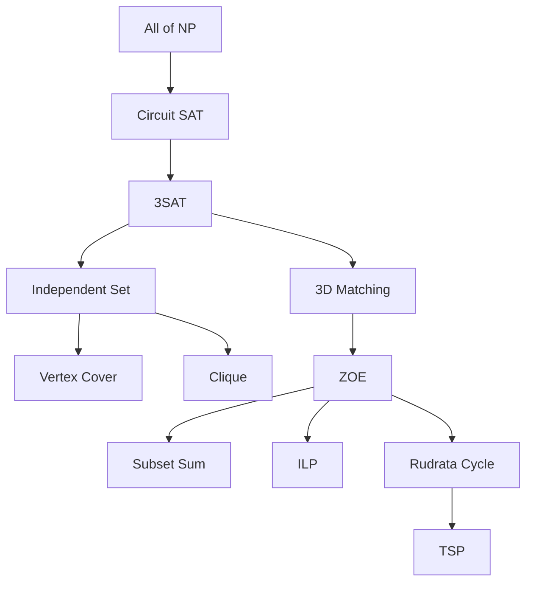

This is part of my algorithms final exam stuff.

The basic map looks like this:



Lets go one at a time.

## All of NP -> Circuit SAT (Cook-Levin Theorem)

**Circuit SAT** : Given a combinatorial circuit built out of `AND`, `OR`, and `NOT` gates, is there a way to set the circuits inputs so that the output is 1 (some inputs may be fixed)? (Think of circuits used in circuit complexity)

This problem can be thought of as a generalization of SAT.

The fact that all problems in NP can be reduced to Circuit SAT is also known as the Cook-Levin theorem.

A proof for this theorem (the one I originally knew about) creates an instance of the SAT problem starting from a non-deterministic Turing machine. But in the lecture the professor defined NP as the class of problems that have a certifier $C(I,S)$ that run in polynomial time. So I'll use a proof that makes use of this definition instead.

Proof:
Take any problem $X$ in NP. By definition, $X$ has a poly-time certifier $C(s,t)$ that checks whether $t$ is a valid certificate for the instance $s$. Therefore, to determine whether $s$ is in $X$, we need to know if there is a certificate $t$ such that $C(s,t) = 1$. Moreover, $t$ must have length $p(\lvert s \rvert)$ (polynomial in $\lvert s \rvert$).

View $C(s,t)$ as an algorithm on $\lvert s \rvert + p(\lvert s \rvert)$, and convert it into a poly-size circuit of size $K$. I won't go too in-depth of the construction and just sketch it out, but it should be pretty straightforward.

We will choose our model of computation for the certifier as the standard Turing machine. The certifier runs for at most polynomial number of steps, which we denote as $T$. At any step, the state of the Turing machine is finite (the contents of the tape, position of the head, and the internal state, which are all bounded by $T$). Therefore we can encode the state of the machine at each step using number of bits polynomial in $\lvert s \rvert$. Call this a configuration.

Now stack each of these configurations:

```
row 0: configuration at step 0 (input s and t written on tape)
row 1: configuration at step 1
...
row T: configuration at step T (machine halts, either accepts/rejects)
```

Then the entire table has a size of around $T \times T$, which is polynomial in $\lvert s \rvert$ as $T$ had polynomial size.

When a Turing machine transitions from one step to the next, the transition only depends on the machines current state, and the value the head is looking at. Then it changes that value to something else, moves left or right, and changes its state. Since there are a constant number of states and tape symbols, all of these transitions can be encoded by a Boolean circuit of constant size. Thus, a transition from step $i$ to step $i+1$ only requires a constant size Boolean circuit.

Therefore we can construct the circuit for $C(s,t)$ as follows:

* Input: $\lvert s \rvert + p(\lvert s \rvert)$ bits that each represent $s$ and $t$
* For each of the $T$ steps: make the constant-size Boolean circuit to transition to the next configuration
* The final row should represent the accept/reject bit

$T$ was polynomial in $\lvert s \rvert$, so the entire circuit has polynomial size. Therefore we have created an instance of Circuit SAT for $C(s,t)$. Therefore all NP problems reduce to Circuit SAT

This isn't a formal proof, as I didn't go into details on how to construct the actual circuits for transition, but this is roughly how the proof flows.

## Circuit SAT -> 3SAT

**3SAT** : An instance of the Boolean Satisfiability problem where each clause has a length of exactly 3.

proof:
We create constraints for each gate.

* `NOT`, output $g$, input $a$: We need $g \leftrightarrow \neg a$. We can write this as $(g \lor a) \land (\neg g \lor \neg a)$
* `AND`, output $g$, input $a, b$: We need $g \leftrightarrow (a \land b)$. We can write this as $(\neg g \lor a) \land (\neg g \lor b) \land (g \lor \neg a \lor \neg b)$
* `OR`, output $g$, input $a, b$: We need $g \leftrightarrow (a \lor b)$. We can write this as $(g \lor \neg a) \land (g \lor \neg b) \land (\neg g \lor a \lor b)$

For the output, create a single clause $(g_{out})$ to force the output to be true.

Now we patch the clauses to have a length of exactly 3.

* 1-literal clause $(l)$: Introduce dummy variables $z_1, z_2$, then we can write $(l \lor z_1 \lor z_2) \land (l \lor z_1 \lor \neg z_2) \land (l \lor \neg z_1 \lor z_2) \land (l \lor \neg z_1 \lor \neg z_2)$
* 2-literal clause $(l_1 \lor l_2)$: Introduce dummy variable $z$, then we can write $(l_1 \lor l_2 \lor z) \land (l_1 \lor l_2 \lor \neg z)$

For gates with more than 2 inputs, we can simply break it down into gates with just 2 inputs.

This way we can reduce any instance of Circuit SAT into an instance of 3SAT.

## 3SAT -> Independent Set

**Independent Set** : Given a graph $G = (V, E)$ and an integer $k$, find whether there exists a subset $I \subseteq V$ such that $\forall u,v \in I$, $(u,v) \notin E$, where $\lvert I \rvert \geq k$. ($I$ is called in independent set of $G$)

proof:
Given an instance $\Phi$ of 3SAT, we construct an instance $(G,k)$ of Independent Set that has an independent set of size $k$ if and only if $\Phi$ is satisfiable.

The graph construction is as follows:

* For each clause $(x_1 \lor x_2 \lor x_3)$, create 3 vertices one for each $x_i$ (could be negated), and connect the 3 vertices into a triangle.
* For all two vertices that each represent $x_i$ and $\neg x_i$, connect them with an edge.
* Set $k$ as the number of clauses in $\Phi$.

Let $S$ be an independent set of this graph of size $k$. By definition, $S$ can only contain one vertex from each triangle, and since all variables are connected with their negations, $S$ can't contain both at the same time. By setting all literals in $S$ as true and all other variables in a consistent way (ex, if negation is true then the variable is false). Then the truth assignment is consistent and all clauses are satisfied.

Now assume we are given a satisfying assignment. Then there exists at least one literal in each clause that is true. Pick one of those literals from each clause. Then this obviously becomes an independent set of size $k$.

Therefore the constructed graph has an independent set of size $k$ if and only if there exists a satisfying truth assignment for $\Phi$. Therefore 3SAT reduces to Independent Set.

## Independent Set -> Vertex Cover

**Vertex Cover** : Given a graph $G = (V, E)$ and an integer $k$, find whether there exists a subset $C \subseteq V$ such that $\forall (u,v) \in E$, either $u \in C$ or $v \in C$, where $\lvert C \rvert \leq k$. ($C$ is called a vertex cover of $G$)

proof:
We show that if $S$ is an independent set, then $V - S$ is a vertex cover.

Let $S$ be an independent set. Consider an edge $(u,v) \in E$. Since $S$ is an independent set, either $u \notin S$ or $v \notin S$. This implies that $u \in V - S$ or $v \in V - S$. Therefore $V - S$ covers any edge $(u,v)$, meaning $V - S$ is a vertex cover.

Let $V - S$ be a vertex cover. Consider two vertices $u \in S$ and $v \in S$. This implies $u \notin V - S$ and $v \notin V - S$. Since $V - S$ is a vertex cover, this means that $(u,v) \notin E$. Therefore any two vertices in $S$ are not connected by an edge, meaning $S$ is an independent set.

Therefore by setting $k_v = \lvert V \rvert - k_i$, we have shown that solving Independent Set is equivalent to solving Vertex Cover. Therefore Independent Set reduces to Vertex Cover.

## Independent Set -> Clique

**Clique** : Given a graph $G = (V,E)$ and an integer $k$, find whether there exists a subset $C \subseteq V$ such that $\forall u,v \in C$, $(u,v) \in E$, where $\lvert C \rvert \geq k$. ($C$ is called a clique of $G$)

proof:
We show that $S$ is an independent set of $G = (V, E)$ if and only if $S$ is a clique of $\overline{G} = (V, \overline{E})$, where for all $u,v \in V$, $(u,v) \in \overline{E}$ if and only if $(u,v) \notin E$.

Let $S$ be any independent set of $G$. Then for all $u,v \in S$, $(u,v) \notin E$, so $(u,v) \in \overline{E}$. Therefore $S$ is a clique of $\overline{G}$.

Let $S$ be a clique of $\overline{G}$. Then for all $u,v \in S$, $(u,v) \in \overline{E}$, so $(u,v) \notin E$. Therefore $S$ is an independent set of $G$.

Therefore solving Independent Set is equivalent to solving Clique. Therefore Independent Set reduces to Clique.

## 3SAT -> 3D Matching

We take an intermediate step to achieve this reduction

### 3SAT -> Constrained 3SAT

**Constrained 3SAT** : An instance of 3SAT where each literal appears at most twice in the Boolean formula.

proof:
Let $\Phi$ be an instance of 3SAT.

For each literal $x$ appearing more than twice in $\Phi$, replace each appearance of $x$ by a new literal $x_1, x_2, \cdots, x_k$. Then add the clause

$$(\overline{x}_1 \lor x_2) \land (\overline{x}_2 \lor x_3) \cdots (\overline{x}_k \land x_1)$$

One can verify that the above clause is satisfied only when all $x_1, x_2, \cdots, x_k$ have the same value.

Repeat this process until no literal appears in $\Phi$ more than twice. Now the problem is an instance of Constrained 3SAT, and one can see that the original instance of 3SAT is satisfiable if and only if the instance of Constrained 3SAT is satisfiable.

Therefore 3SAT can be reduced to Constrained 3SAT.

### Constrained 3SAT -> 3D Matching

**3D Matching** : Given sets $A, B, C$ each of $n$ elements and a set $S$ of triples $(a, b, c)$ with $a \in A, b \in B, c \in C$, find whether there exists $n$ disjoint triples.

proof:
Given an instance of Constrained 3SAT, we construct an instance of 3D Matching that has a perfect matching if and only if $\Phi$ is satisfiable.

The construction is as follows:

* Create a gadget for each variable $x_i$ with 4 cores and 4 tip elements, where the core consists of 2 vertices from 2 of the 3 given sets.
* A perfect 3D matching must use exactly two triples in each gadget.

The yellow and blue vertices are the core. A variable is set true if we choose the triples on the left/right, and false if we choose the triples on the top/bottom.

<figure>
<center></center>
<figcaption align = "center">A single gadget</figcaption>
</figure>

Then, for each clause, create two elements (blue and yellow) and three triples. The triples connect the two newly created elements, along with one green element for each variable in the clause. If $x_i$ is not negated in the clause, it connects the top or bottom green, otherwise it connects the left or right green. Then, create 2 more elements, each of blue and yellow, and create triples that connect those two and the other green elements. These are the cleanup gadgets.

Repeat for all clauses, and we get something like this.

<figure>
<center></center>
<figcaption align = "center">Full graph</figcaption>
</figure>

One can see that if a perfect matching exists, we can recover a satisfying truth assignment, and from a satisfying truth assignment, we can find a matching where all gadgets are matched.

Therefore every instance of Constrained 3SAT can be reduced to an instance of 3D Matching.

## 3D Matching -> ZOE

**ZOE (Zero One Equation)** : Given an $m \times n$ matrix $A$ with 0-1 entries, find whether there exists a 0-1 vector $x = (x_1, \cdots, x_n)$ such that the $m$ equations $Ax = 1$ are satisfied, where 1 denotes the column vector of all 1's.

proof:
Given an instance of 3D Matching ($m$ boys, $m$ girls, $m$ pets, and $n$ triples), we can construct an instance of ZOE as follows:
* Create 0-1 variables $x_1, x_2, \cdots, x_n$, one per triple, where $x_i = 1$ means that the $i$'th triple is chosen in the matching, else it wasn't chosen.
* For each boy (or girl/pet), suppose that the triple containing it are the ones numbered $j_1, j_2, \cdots, j_k$, then we create $x_{j_1} + x_{j_2} + \cdots + x_{j_k} = 1$, which state that exactly one of these triples must be contained in the matching.

One can see that a perfect matching for 3D Matching exists if and only if a solution for ZOE exists. Therefore 3D Matching reduces to ZOE.

## ZOE -> Subset Sum

**Subset Sum** : Given a set of integers and a target $W$, find whether there exists a subset of the given integers that adds up exactly to $W$.

proof:
Given an instance $A$ of ZOE, we construct an instance of Subset Sum as follows. A basic idea is that 0-1 vectors can encode numbers. Think of the columns as integers in base $n+1$. Then this is basically the subset sum problem. Therefore ZOE reduces to Subset Sum.

## ZOE -> ILP

**ILP (Integer Linear Programming)** : Given an $m \times n$ matrix $A$ and a vector $b$, find an integer vector $x$ that satisfies $Ax \leq b$.

proof:
We are given an instance of ZOE: a matrix $A$ with 0-1 entries.

To construct an instance of ILP, add $x_i \leq 1$ and $-x_i \leq 0$ for each variable $x_i$. Then the resulting instance of ILP has an integer solution if and only if the given ZOE has a 0-1 vector solution.

Therefore every instance of ZOE can be reduced to an instance of ILP. Thus ZOE reduces to ILP.

## ZOE -> Hamiltonian Cycle

**Hamiltonian Cycle** : Given a graph $G = (V, E)$ find whether there exists a cycle that visits all vertices exactly once.

Here, we will take an intermediate step.

### ZOE -> Hamiltonian Cycle with Paired Edges

**Hamiltonian Cycle with Paired Edges** : Given a graph $G = (V,E)$ and a set $C$ of pairs of edges, find whether there exists a cycle that (1) visits all vertices exactly once, (2) for ever pair $(e, e^\prime) \in C$, traverses exactly one of $e$ and $e^\prime$

proof:
We are given an instance of ZOE: a matrix $A$ with 0-1 entries.

For each variable $x$, add two parallel edges, one for $x = 0$, and one for $x = 1$. Also, for each constraint $x_1 + x_2 + \cdots + x_t = 1$, add $t$ parallel edges, one for each variable.

<figure>
<center></center>
<figcaption align = "center">Graph construction</figcaption>
</figure>

For edge pairs, if an equation $\gamma$ contains a variable $x$, then add the pair $(e,e^\prime)$ where
* $e$ is the edge corresponding to the appearance of $x$ in $\gamma$
* $e^\prime$ is the edge corresponding to $x = 0$

It is obvious that a solution to the Hamiltonian Cycle with Paired Edges exists if and only if a solution to ZOE exists. Therefore ZOE reduces to Hamiltonian Cycle with Paired Edges.

### Hamiltonian Cycle with Paired Edges -> Hamiltonian Cycle

proof:
Given an instance $(G = (V, E), C)$ of Hamiltonian Cycle with Paired Edges, we construct an instance of Hamiltonian Cycle as follows.

For each edge pair ($e = ab, e^\prime = cd$), replace $e, e^\prime$ with the following gadget.

<figure>
<center></center>
<figcaption align = "center">Single gadget</figcaption>
</figure>

If some other pair in $C$ involves $ab$, replace $ab$ with $af$. The traversal of $af$ is an indication that $ab$ in the old graph would be traversed.

Therefore we can reduce every instance of Hamiltonian Cycle with Paired Edges to an instance of Hamiltonian Cycle, thus Hamiltonian Cycle with Paired Edges reduces to Hamiltonian Cycle.

## Hamiltonian Cycle -> TSP

**TSP (Travelling Salesman Problem)** : Given a set of $n$ vertices, their pairwise distances, and a budget $b$, find whether there is a tour of total cost $b$ or less that passes through every vertex exactly once

proof:
We will reduce from Hamiltonian Cycle. Given a graph $G = (V,E)$, let $H = (V,E^\prime)$ be the complete graph such that for each $e \in E^\prime$

$$c(e) = \begin{cases}
1 \quad &e \in E \\
2 \quad &e \notin E
\end{cases}$$

Then there is a shortest tour of length $n$ in $H$ if and only $G$ has a Hamiltonian cycle. Therefore Hamiltonian Cycle reduces to TSP.
