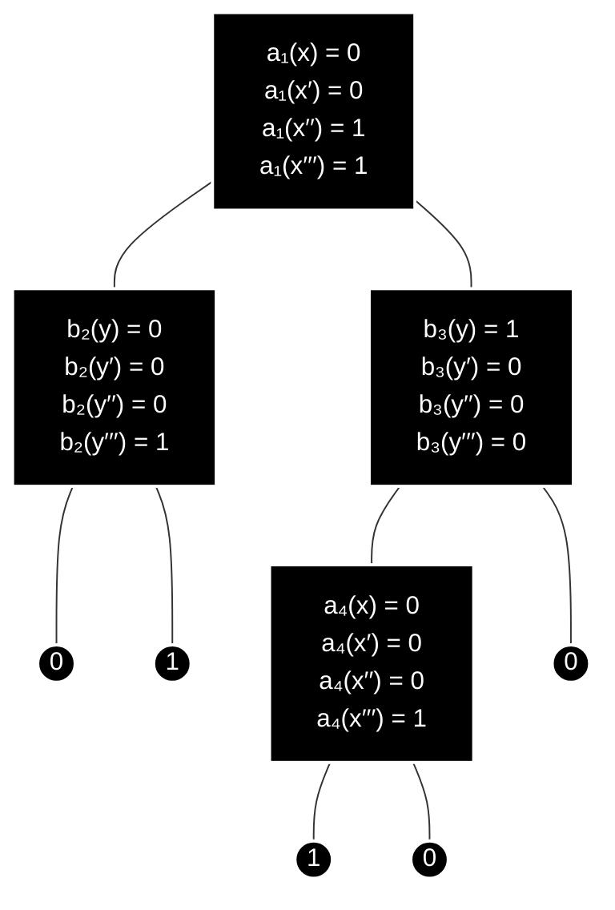

So recently I read a paper about limitations of the transformer model, and in that paper the authors modeled the transformer as an autoregressive communication protocol, and used that to prove bounds. I had a very hard time reading that, but I later found out that the techniques used in the paper were similar to that of techniques used to show bounds in communication complexity (which is kind of obvious I guess). Which leads me to here, where I decided to take a look at communication complexity, just the basics for now.

One motivation for communication complexity are situations in where a system must perform some task when the input is distributed among multiple parts of the system. In communication complexity, we mostly care about the communication, and want to use as little communication as possible. For the most part, we don't care much about the computational power of the system itself.

With that in mind lets start.

## The Model

Let $X, Y, Z$ be arbitrary finite sets and $f : X \times Y \rightarrow Z$ a function. There are two players, Alice and Bob, who wish to evaluate $f(x,y)$ for some input $x \in X$ and $y \in Y$. The problem is that Alice only knows $x$ and Bob only knows $y$. Thus, they must communicate with each other in order to find $f(x,y)$.

The communication is carried out according to a fixed protocol $\mathcal{P}$ (which depends only on $f$). The protocol consists of the players sending bits to each other until the value of $f$ can be determined. The protocol must determine whether the run terminates, and if so specify the answer given by the protocol, and if the run hasn't ended, which player sends a bit of communication next. This information must depend only on the bits communicated so far.

We are only interested in the amount of communication between Alice and Bob and ignore the actual computation they make, so we assume Alice and Bob have unlimited computational power. The cost of a protocol $\mathcal{P}$ on input $(x,y)$ is the number of bits communicated, and the cost of $\mathcal{P}$ is the worst case (i.e. maximal) cost of $\mathcal{P}$ over all inputs $(x,y)$. The complexity of $f$ is the minimum cost of a protocol that solves $f$.

The following is a formal definition of a protocol.

**Definition 1.1** *A protocol $\mathcal{P}$ over domain $X \times Y$ with range $Z$ is a binary tree where each node $v$ is labeled either by a function $a_v : X \rightarrow \lbrace0,1\rbrace$ or by a function $b_v : Y \rightarrow \lbrace0,1\rbrace$, and each leaf is labeled with an element $z \in Z$.*

*The* value of the protocol $\mathcal{P}$ *on input $(x,y)$ is the label of the leaf reached by starting from the root, and walking on the tree. At each internal node $v$ labeled by $a_v$ walking left if $a_v(x) = 0$ and right if $a_v(x) = 1$, and at each internal node labeled by $b_v$ walking left if $b_v(y) = 0$ and right if $b_v(y) = 1$. The* cost of the protocol $\mathcal{P}$ on input $(x,y)$ *is the length of the path taken on input $(x,y)$. The* cost of the protocol $\mathcal{P}$ *is the height of the tree*.

I feel like the definition is quite intuitive. The following is a protocol tree for some function $f$ defined on $X \times Y$ for $X = \lbrace x,x^\prime,x^{\prime\prime},x^{\prime\prime\prime}\rbrace$ and $Y = \lbrace y,y^\prime,y^{\prime\prime},y^{\prime\prime\prime}\rbrace$. 

The function $f$ computed by this protocol is the following:

$$
\begin{array}{c|cccc}
 & y & y' & y'' & y''' \\
\hline
x     & 0 & 0 & 0 & 1 \\
x'    & 0 & 0 & 0 & 1 \\
x''   & 0 & 0 & 0 & 0 \\
x'''  & 0 & 1 & 1 & 1
\end{array}
$$

**Definition 1.2** *For a function $f : X \times Y \rightarrow Z$ the* (deterministic) communication complexity *of $f$ is the minimum cost of $\mathcal{P}$, over all protocols $\mathcal{P}$ that compute $f$. We denote the (deterministic) communication complexity of $f$ by $D(f)$.*

A simple way to solve for any $f$ is for Alice to send all her info to Bob ($\log \lvert X \rvert$ bits), Bob computes $f(x,y)$, and then sends the answer back to Alice ($\log \lvert Z \rvert$ bits). Therefore:

**Proposition 1.3** *For every function $f : X \times Y \rightarrow Z$*

$$D(f) \leq \log \lvert X \rvert + \log \lvert Z \rvert$$

One exercise:

**Exercise 1.9** Show that for every function $f : X \times Y \rightarrow Z$, $D(f) \geq \log \lvert \text{Range}(f) \rvert$, where $\text{Range}(f)$ is the set of all $z \in Z$ for which there exists a pair $(x,y) \in X \times Y$ such that $f(x,y) = z$.

**Solution** Let $d = D(f)$. By definition, there is a protocol $\mathcal{P}$ computing $f$ whose tree has depth $d$. Each bit communicated chooses one of two branches, so the tree has at most $2^d$ leaves.

Now consider the outputs of $f$. For every $z \in \text{Range}(f)$, there is at least one pair $(x_z, y_z)$ such that $f(x_z, y_z) = z$. Therefore when the protocol runs on $(x_z, y_z)$ it terminates at some leaf labeled $z$. Here, distinct output values must correspond to distinct leaves: a single leaf has only one output label, so it cannot correctly output both $z$ and $z^\prime \ne z$.

Therefore the protocol needs at least one leaf for every output value:

$$\#\text{leaves}(\mathcal{P}) \geq \lvert \text{Range}(f) \rvert$$

Recall that the upper bound of the number of leaves was $2^d$. Therefore

$$2^d \geq \lvert \text{Range}(f) \rvert$$

Taking the logarithm on both sides we get our result.

$$D(f) = d \geq \log \lvert \text{Range}(f) \rvert$$

$\blacksquare$

For the most case, we are going to look at Boolean functions $f : X \times Y \rightarrow \lbrace0,1\rbrace$. The bound above only gives $D(f) \geq 1$, which is useless. From this point on, unless explicitly stated, $Z = \lbrace0,1\rbrace$.

## Rectangles

Proving lower bounds on communication complexity comes from a combinatorial view on protocols. The idea is to view protocols as a way to partition the space $X \times Y$ into sets such that for all input pairs in the same set the same communication is sent. Then we show that these sets of inputs are restricted to have a special structure, which is imposed by the fact that Alice only sees $x$ and Bob only sees $y$. This leads to rectangles.

**Definition 1.10** *Let $\mathcal{P}$ be a protocol and $v$ be a node of the protocol tree. $R_v$ is the set of inputs $(x,y)$ that reach node $v$.*

It immediately follows that

**Proposition 1.11** *If $L$ is the set of leaves of a protocol $\mathcal{P}$, then $\lbrace R_\ell\rbrace_{\ell \in L}$ is a partition of $X \times Y$*.

**Definition 1.12** *A* combinatorial rectangle *(in short, a rectangle) in $X \times Y$ is a subset $R \subseteq X \times Y$ such that $R = A \times B$ for some $A \subseteq X$ and $B \subseteq Y$*.

The following is an equivalent definition:

**Proposition 1.13** *$R \subseteq X \times Y$ is a rectangle if and only if*

$$(x_1, y_1) \in R \space and \space (x_2, y_2) \in R \Rightarrow (x_1, y_2) \in R$$

**Proof** $(\Rightarrow)$ Assume $R$ is a rectangle, that is $R = A \times B$. If $(x_1, y_1) \in R$, then $x_1 \in A$. Similarly $y_2 \in B$. Therefore $(x_1, y_2) \in A \times B = R$.

$(\Leftarrow)$ Define the sets

$$A = \lbrace x \space\vert\space \text{exists } y \text{ such that } (x,y) \in R\rbrace$$

and

$$B = \lbrace y \space\vert\space \text{exists } x \text{ such that } (x,y) \in R\rbrace$$

We claim $R = A \times B$. $R \subseteq A \times B$ is clear from the definition of $A$ and $B$. Consider $(x,y) \in A \times B$. Since $x \in A$, there exists $y^\prime$ such that $(x, y^\prime) \in R$. Similarly there exists $x^\prime$ such that $(x^\prime, y) \in R$. Using the assumption this implies $(x,y) \in R$. $\blacksquare$

The connection between rectangles and communication complexity is the following:

**Proposition 1.14** *For every protocol $\mathcal{P}$ and leaf $\ell$ in it, $R_\ell$ is a rectangle*.

In fact, $R_v$ is a rectangle for every node $v$, not just the leaves. The proof is by induction on the depth of $v$, which I'll skip because it's not that hard.

Another proof can be done using the equivalent definition of rectangles. I'll write this one down as I think it's quite interesting.

**Proof** Assume $(x_1, y_1) \in R_\ell$ and $(x_2, y_2) \in R_\ell$. we will show that also $(x_1, y_2) \in R_\ell$, that is, we show that on input $(x_1, y_2)$ the protocol will behave the same as on $(x_1, y_1)$ and $(x_2, y_2)$. We will follow the communication performed (that is, the path taken on the tree) on input $(x_1, y_2)$ and show that it never deviates from the path to $\ell$.

If we have reached a node $v$ on the path which Alice speaks, then because she cannot distinguish between $(x_1, y_2)$ and $(x_1, y_1)$ (in both cases she evaluates $a_v(x_1)$) she will behave the same on both inputs. Thus on $(x_1, y_2)$ we will also move towards $\ell$. If we have reached a node $v$ in which Bob speaks, by the same reason Bob cannot distinguish between $(x_1, y_2)$ and $(x_2, y_2)$ so he will behave the same on both inputs, that is, again we will move towards $\ell$. $\blacksquare$

In the proof, the reason $R_\ell$ is a rectangle is that Alice an Bob each know only one of the inputs $x$ and $y$.

If a protocol $\mathcal{P}$ computes a function $f$ then for every leaf $\ell$ of $\mathcal{P}$, all inputs $(x,y) \in R_\ell$ must have the same value of $f$.

**Definition 1.15** *A subset $R \subseteq X \times Y$ is called* $f$-monochromatic *(in short, monochromatic) if $f$ is fixed on $R$*.

<figure>

<figcaption align = "center"></figcaption>
</figure>

The above table is an example of a 0-monochromatic rectangle.

**Lemma 1.16** *Any protocol $\mathcal{P}$ for a function $f$ induces a partition of $X \times Y$ into $f$-monochromatic rectangles. The number of rectangles is the number of leaves of $\mathcal{P}$*.

**Corollary 1.17** *If any partition of $X \times Y$ into $f$-monochromatic rectangles requires at least $t$ rectangles, then $D(f) \geq \log t$*.

**Proof** By Lemma 1.16, the leaves of any protocol for $f$ induce a partition of $X \times Y$ into $f$-monochromatic rectangles. Hence, by the assumption, any such protocol must have at least $t$ leaves and thus the depth of its tree (since the tree is binary) is at least $\log t$. $\blacksquare$

This gives a strategy to find lower bounds: prove lower bounds on the number of rectangles in any partition of $X \times Y$ into monochromatic rectangles.

We now look at some techniques to do this.

## Fooling Sets and Rectangle Size

The first technique is called the fooling set technique. It says that if we have a large set of input pairs such that no two of them can be in a single monochromatic rectangle, this implies that the number of monochromatic rectangles is large. We use the idea of Lemma 1.16 and Proposition 1.13, which together imply that if two input pairs $(x_1, y_1)$ and $(x_2, y_2)$ are in the same monochromatic rectangle induced by a protocol $\mathcal{P}$, then the value of $f$ on both of them is some $z$, and that the two input pairs $(x_1, y_2)$ and $(x_2, y_1)$ must also be in the same monochromatic rectangle. In other words, if $f$ has a different value on either $(x_1, y_2)$ or $(x_2, y_1)$, then $(x_1, y_1)$ and $(x_2, y_2)$ cannot be in the same rectangle.

**Definition 1.19** *Let $f : X \times Y \rightarrow \lbrace0,1\rbrace$. A set $S \subset X \times Y$ is called a* fooling set *(for $f$) if there exists a value $z \in \lbrace0,1\rbrace$ such that*

* *For every $(x,y) \in S$, $f(x,y) = z$*
* *For every two distinct pairs $(x_1, y_1)$ and $(x_2, y_2)$ in $S$, either $f(x_1, y_2) \ne z$ or $f(x_2, y_1) \ne z$*

**Lemma 1.20** *If $f$ has a fooling set $S$ of size $t$, then $D(f) \geq \log t$*.

**Proof** It is enough to prove that no monochromatic rectangle contains more than one element of $S$. Assume that a rectangle $R$ contains two distinct pairs $(x_1, y_1)$ and $(x_2, y_2)$ that belong to $S$. By Proposition 1.13, it must also contain $(x_1, y_2)$ and $(x_2, y_1)$. However, since $S$ is a fooling set, the value of $f$ on both $(x_1, y_1)$ and $(x_2, y_2)$ is $z$, whereas on at least one of $(x_1, y_2)$ and $(x_2, y_1)$ the value of $f$ is different than $z$. It follows that $R$ is not monochromatic. Therefore, at least $t$ rectangles are needed to cover $S$, and the lemma follows by Corollary 1.17. $\blacksquare$

While a simple strategy, it allows us to give tight bounds to some functions.

**Example 1.21** Alice and Bob each hold an $n$-bit string, $x, y \in \lbrace0,1\rbrace^n$. The equality function, $\text{EQ}(x, y)$ is defined to be 1 if $x = y$ and 0 otherwise. A fooling set of size $2^n$ is

$$S = \lbrace(\alpha, \alpha) \space \vert \space \alpha \in \lbrace0,1\rbrace^n\rbrace$$

(because for every $\alpha$, $\text{EQ}(\alpha, \alpha) = 1$, whereas for every $\alpha \ne \beta$, $\text{EQ}(\alpha, \beta) = 0$). It follows that $D(\text{EQ}) \geq n$. By also counting 0-rectangles, we conclude $D(\text{EQ}) \geq n+1$. Finally, recall that $D(f) \leq n+1$ for every function $f : \lbrace0,1\rbrace^n \times \lbrace0,1\rbrace^n \rightarrow \{0,1\}$ (by Proposition 1.3). Therefore $D(\text{EQ}) = n+1$.

The fooling set technique is a special case of a more general technique for proving lower bounds on the communication complexity. The idea is to prove that the "size" of every monochromatic rectangle is small, implying that many monochromatic rectangles are needed in any partition of $X \times Y$. Here, the "size" measure can be chosen to our advantage.

**Proposition 1.24** *Let $\mu$ be a probability distribution of $X \times Y$. If any $f$-monochromatic rectangle $R$ has measure $\mu(R) \leq \delta$, then $D(f) \geq \log 1/\delta$*.

**Proof** Since $\mu(X \times Y) = 1$, there must be at least $1/\delta$ rectangles in any $f$-monochromatic partition of $X \times Y$. Thus, the bound follows from Corollary 1.17. $\blacksquare$

Consider a fooling set $S$ of size $t$ and define a probability distribution $\mu$ as follows: $\mu(x, y) = 0$ for $(x,y) \notin S$ and $\mu(x,y) = 1/t$ for $(x,y) \in S$. Lemma 1.20 says that every monochromatic rectangle $R$ can contain at most one element of the fooling set, so $\mu(R) \leq 1/t$. This shows that the fooling set is a special case of proposition 1.24. Another special case is showing that all monochromatic rectangles are of size smaller than $k$, then the number of rectangles is at least $\lvert X \rvert \lvert Y \rvert / k$ and hence $D(f) \geq \log \lvert X \rvert + \log \lvert Y \rvert - \log k$.

**Example 1.25** Alice and Bob each hold an $n$-bit string $x,y \in \{0,1\}^n$. The inner product function, $\text{IP}$ is defined by $\text{IP}(x,y) = \sum_{i=1}^n x_iy_i  \mod 2$. We will show that any $0$-monochromatic rectangle covers at most $2^n$ of the input pairs (out of $2^{2n}/2$ 0s). Thus, if $\mu$ is the uniform distribution on the 0s of the function then, for all rectangles $R$, $\mu(R) \leq 2^{-(n-1)}$. This implies, by Proposition 1.24, that $D(\text{IP}) \geq n - 1$.

Let $R = A \times B$ be any $0$-rectangle. First, replace $A$ by $A^\prime = span(A)$ and $B$ by $B^\prime = span(B)$, where $span(C)$ denotes the linear span, over the vector space $Z_2^n$, of vectors in the set $C$. The extended rectangle $A^\prime \times B^\prime$ may have larger area but since the inner product satisfies

$$\langle a + a^\prime, b + b^\prime \rangle = \langle a,b\rangle + \langle a, b^\prime \rangle + \langle a^\prime, b \rangle + \langle a^\prime, b^\prime \rangle$$

then $A^\prime \times B^\prime$ is still $0$-monochromatic. Finally, since $A^\prime$ and $B^\prime$ are orthogonal subspaces of $Z_2^n$, then by linear algebra the sum of $dim(A^\prime)$ and $dim(B^\prime)$ is at most $n$, the dimension of the whole space. Therefore, the size of the rectangle is bounded by $\lvert A^\prime \rvert \lvert B^\prime \rvert = 2^{dim(A^\prime)}2^{dim(B^\prime)} \leq 2^n$.

## Rank Lower Bound

We now look at another technique that gives a lower bound on the number of monochromatic rectangles in an algebraic way. We associate with every function $f : X \times Y \rightarrow \{0,1\}$ a matrix $M_f$ of dimensions $\lvert X \rvert \times \lvert Y \rvert$. The rows of $M_f$ are indexed by the elements of $X$ and the columns by the elements of $Y$. The $(x,y)$ entry of $M_f$ is simply defined as $f(x,y)$.

**Definition 1.27** *$rank(f)$ is the linear rank of the matrix $M_f$ over the field of reals*.

**Lemma 1.28** *For any function $f : X \times Y \rightarrow \{0,1\}$*,

$$D(f) \geq \log rank (f)$$

**Proof** Let $\mathcal{P}$ be a protocol for $f$ and let $L_1$ be the set of leaves of $\mathcal{P}$ in which the output is $1$. For each leaf $\ell \in L_1$, define a matrix $M_\ell$ by $M_\ell (x,y) = 1$ for $(x,y) \in R_\ell$ and $M_\ell (x,y) = 0$ for $(x,y) \notin R_\ell$, where $R_\ell$ is the rectangle of all inputs reaching the leaf $\ell$. With this notation, observe that every $(x,y)$ for which $f(x,y) = 0$ is $0$ in all the matrices $M_\ell$, whereas every $(x,y)$ for which $f(x,y) = 1$ is $1$ in a single such matrix.

In other words,

$$M_f = \sum_{\ell \in L_1} M_\ell$$

By the properties of rank, we have

$$rank(M_f) \leq \sum_{\ell \in L_1} rank(M_\ell)$$

Finally, $rank(M_\ell) = 1$ so $rank(M_f) \leq \lvert L_1 \rvert \leq \lvert L \rvert$. In particular, $\mathcal{P}$ must have at least $rank(f)$ leaves and the lemma follows by Corollary 1.17. $\blacksquare$

Note that the proof gives a lower bound on the number of 1-rectangles. By switching the role of 0 and 1 we also get a lower bound on the number of 0-rectangles in any partition. Also note that the ranks of the matrices $M_f$ and $M_{not(f)}$ differ by at most 1 since $M_{not(f)} = J - M_f$, where $J$ is the all-1 matrix (whose rank is 1). Therefore Lemma 1.28 implies that

$$D(f) \geq \log (2rank(f) - 1)$$

**Example 1.29** The matrix $M_{\text{EQ}}$ corresponding to the function $\text{EQ}$ is simply the identity matrix, for which $rank(M_\text{EQ}) = 2^n$ and hence $D(\text{EQ}) \geq n$. Next consider the inner product function $\text{IP}$. The matrix $N = (M_{\text{IP}})^2$ has a simple form: the $(y, y^\prime)$ entry of $N$ is simply $\sum_{z \in \{0,1\}^n} \langle y, z \rangle \cdot \langle z, y^\prime \rangle$, which is exactly the number of $z$'s for which $\langle y, z \rangle = \langle z, y^\prime \rangle = 1$. By the properties of inner product, $N$ is a diagonal matrix with the value $2^{n-1}$ on the diagonal and the value $2^{n-2}$ off the diagonal (except for the first row and first column, which are identically 0). Thus $N$ has almost full $(2^n - 1)$ rank and so is $M_{\text{IP}}$ (since $rank(AB) \leq \min (rank(A),rank(B))$). It follows that $D(\text{IP}) \geq n$.

That's about it for the very basics of communication complexity. Hopefully this helps me in my research. Cheers.
